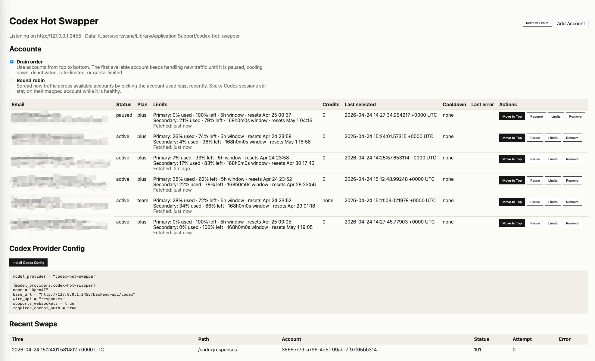

# Codex Hot Swapper

Codex Hot Swapper is a tiny local account switchboard for Codex. Add multiple ChatGPT accounts, point Codex at the local provider endpoint, and swap which account handles the next request from a small browser UI.

It is intentionally minimal: one Go binary, local JSON storage, OAuth login, usage refresh, sticky session continuity, and a manual **Move to Top** button when you want to make an account the active priority.



## Features

- Local Codex-compatible provider at `http://127.0.0.1:2455/backend-api/codex`
- Browser OAuth flow for adding ChatGPT accounts
- Manual hot swap between accounts from the UI
- Configurable account strategy: drain order or round robin
- Pause, resume, and remove accounts
- Usage and credit refresh per account
- Sticky session continuity for Codex conversation headers
- Automatic token refresh when credentials are old or upstream returns `401`
- Recent request log stored locally as JSONL

## Quick Start

Download a binary from the [latest release](https://github.com/SU1199/codex-hot-swapper/releases/latest), unzip it, and run it.

Or run from source:

```bash
go run .
```

The app opens `http://127.0.0.1:2455` automatically.

1. Click **Add Account** and finish the browser login.
2. Click **Install Codex Config** to update `~/.codex/config.toml`, or copy the provider config manually.
3. Start Codex with the `codex-hot-swapper` provider.

Example Codex config:

```toml
model_provider = "codex-hot-swapper"

[model_providers.codex-hot-swapper]
name = "OpenAI"
base_url = "http://127.0.0.1:2455/backend-api/codex"
wire_api = "responses"
supports_websockets = true
requires_openai_auth = true
```

## Hot Swapping

The UI offers two account strategies:

- **Drain order**: use accounts from top to bottom. New traffic keeps using the first available account until that account is paused, cooling down, deactivated, rate-limited, or quota-limited. Only then does traffic move to the next account.
- **Round robin**: spread new traffic across available accounts by picking the account used least recently.

The account table includes **Move to Top** for each account. Clicking it moves that account to the front of the priority order and clears existing sticky mappings, so new Codex traffic moves to the selected account instead of staying pinned to an earlier one.

The app still keeps conversation continuity when Codex sends session headers. If you need to force a move mid-session, use **Move to Top** before the next request.

## Codex Config Installer

The UI includes **Install Codex Config**. It updates only the minimal settings needed for this tool:

- sets top-level `model_provider = "codex-hot-swapper"`;
- replaces this tool's `[model_providers.codex-hot-swapper]` block if it already exists;
- appends the provider block if missing;
- preserves unrelated settings, profiles, and provider blocks.

Before writing, it creates a timestamped backup next to the config file:

```text
~/.codex/config.toml.bak-YYYYMMDD-HHMMSS
```

## Token Refresh

Account tokens refresh automatically:

- when the stored token age is older than 8 days;
- when an upstream request returns `401`;
- when a usage refresh sees `401` or `403`;
- during startup usage refresh for accounts that need it.

When refresh succeeds, the new access token, refresh token, and ID token are written back to local storage.

## Local Data

Data is stored under:

```text
~/Library/Application Support/codex-hot-swapper
```

Important files:

- `accounts.json`: account credentials and state
- `settings.json`: upstream and OAuth settings
- `runtime.json`: sticky session mappings
- `requests.jsonl`: recent request history

The app listens only on `127.0.0.1:2455`.

## Build

```bash
go build -o codex-hot-swapper .
./codex-hot-swapper
```

## Releases

Release binaries are built by GitHub Actions when a version tag is pushed:

```bash
git tag v0.1.0
git push origin v0.1.0
```

The release includes macOS, Linux, and Windows binaries for `amd64` and `arm64`, plus SHA256 checksum files.

## Test

```bash
go test ./...
```
